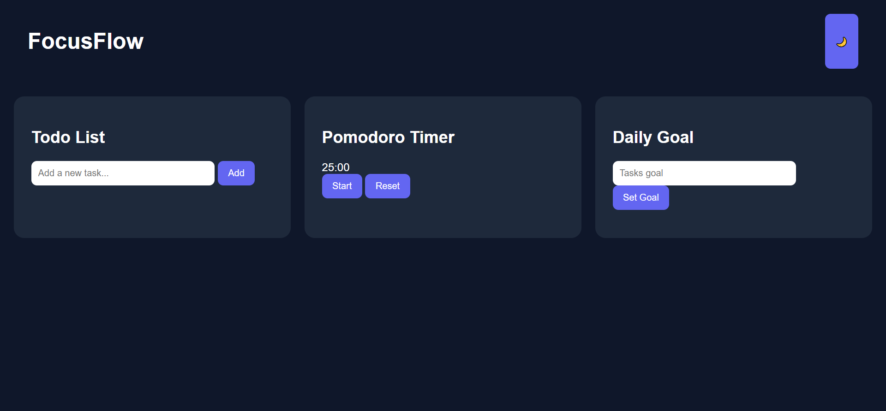

🚀 FocusFlow – Modern Productivity Dashboard

A clean and powerful productivity web app built using pure HTML, CSS, and JavaScript.
Designed to help students, developers, and professionals stay focused and organized.

🌐 Live Demo

https://haseeb-mernstack.github.io/focusflow-productivity-dashboard/

✨ Features

✅ Todo List with localStorage (Data persists after refresh)

⏱ Pomodoro Timer (25-minute focus sessions)

🎯 Daily Goal Tracking

🌙 Dark / Light Mode Toggle

📱 Fully Responsive Design

💾 Automatic Data Saving

⚡ Lightweight & Fast

🔥 100% Free & Open Source

📸 Preview

📂 Project Structure
focusflow-productivity-dashboard/
│
├── index.html
├── css/
│ └── style.css
├── js/
│ └── script.js
└── README.md

🛠 Built With

HTML5

CSS3 (Grid, Flexbox, Variables)

Vanilla JavaScript (ES6)

LocalStorage API

No frameworks. No libraries. Pure frontend.

🚀 How To Use

1️⃣ Clone the repository

git clone https://github.com/Haseeb-MernStack/focusflow-productivity-dashboard.git

2️⃣ Navigate into the folder

cd focusflow-productivity-dashboard

3️⃣ Open index.html in your browser

That’s it 🎉

🧠 How It Works

Tasks are saved in localStorage

Timer runs using setInterval

Dark mode toggles CSS variables

Goal progress calculates based on task count

📱 Responsive Design

Optimized for:

Desktop

Tablet

Mobile

Large Screens

🎯 Customization Guide

You can easily modify:

Theme colors → :root in style.css

Pomodoro duration → Change 1500 seconds in script.js

Add new features → Extend script.js

Improve UI → Customize CSS styles

🚀 Future Improvements (Optional Ideas)

Drag & Drop Tasks

Task Completion Checkbox

Habit Tracker

Weekly Analytics Chart

Export Tasks to JSON

PWA Support (Installable App)

Notifications with Sound

🤝 Contributing

Contributions are welcome!

If you want to improve FocusFlow:

Fork the repository

Create a new branch

Submit a Pull Request

⭐ Support

If you found this project helpful:

⭐ Star the repository

🍴 Fork it

📢 Share it with others

📄 License

This project is licensed under the MIT License.
Free for personal and commercial use.

👨‍💻 Author

Built with ❤️ by Haseeb MernStack

GitHub: https://github.com/Haseeb-MernStack

YouTube: https://youtube.com/@haseebmernstack
